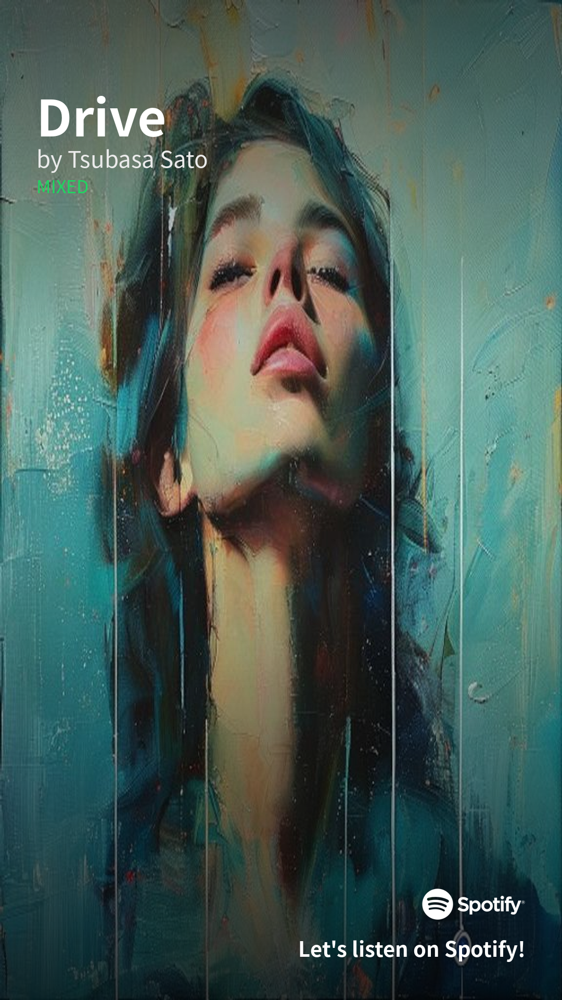
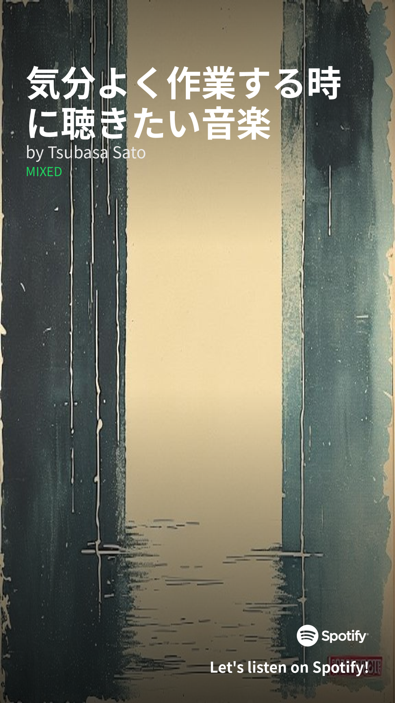

# EnMP banana

[](https://colab.research.google.com/github/Rhizobium-gits/EnMP-banana/blob/main/EnMP_banana.ipynb)

**EnMP banana** = **En**hance **M**y **P**laylist **banana**.

Spotifyの公開プレイリストURLを1本入れるだけで、その中身（アルバム画像・ジャンル・タイトル・作者）を解析し、
**Instagramストーリー規格（1080×1920, 9:16）の縦サムネ画像** を自動生成するツール。
右下にはSpotifyロゴと "Let's listen on Spotify!" のCTA、上部にプレイリスト名と作者名が崩れずレンダリングされる。

## サンプル出力

`provider="pollinations"` で生成した実例（**完全無料・認証不要**で動作）：

| `Drive` | `気分よく作業する時に聴きたい音楽` |
|---|---|
|  |  |
| Drive系の鮮やかなジャケ写群から → 青緑のオイルペインティング肖像画 | 落ち着いた茶系のジャケ写群から → グランジ縦縞テクスチャ |

各プレイリストの **ジャケ写から抽出した明るさ・彩度・色温度・主要色** が AI のプロンプトに渡され、
さらに 12 種類のアートメディウム（水彩 / 油絵 / インク / パステル / ガッシュ / リソグラフ etc.）が
プレイリストIDから決定論的にローテーションするので、プレイリストごとに別の絵柄になる。

---

## クイックスタート（Colab）

[`EnMP_banana.ipynb`](./EnMP_banana.ipynb) を Colab で開いて、上から実行するだけ。

### 必要な鍵

| 鍵 | 取り方 |
|---|---|
| Spotify Client ID / Secret | https://developer.spotify.com/dashboard で Create app → コピー。**Redirect URI に `http://127.0.0.1:8888/callback` を登録**しておく（Authorization Code Flow用） |
| Gemini API key（任意） | https://aistudio.google.com/apikey 。`provider="gemini"` を使うときだけ必要。**Geminiの画像生成は2026年現在フリーtier不可、有料tier必須** |
| OpenAI API key（任意） | https://platform.openai.com/api-keys 。`provider="openai"` を使うときだけ必要 |

**`provider="collage"` または `"pollinations"` なら APIキーゼロで動く**ので、Spotifyの鍵だけあればOK。

### Spotify認証

初回実行時、Spotipy が認証URLをセル下に表示する：

1. URLをコピーしてブラウザで開く → Spotifyにログイン → "Agree"
2. リダイレクトされた404ページのURLバーを**まるごとコピー**（`http://127.0.0.1:8888/callback?code=...`）
3. Colab の `Enter the URL you were redirected to:` プロンプトに貼り付けてEnter

`.spotify_cache` にtokenが保存され、以降は自動再利用。

---

## 4種類の背景生成プロバイダ

| Provider | コスト | 認証 | 仕組み |
|---|---|---|---|
| `collage` | **無料** | 不要 | PILのみ。ジャケ写の主要色抽出+ジャケ写ぼかしブロブ+中央2x2グリッド合成。確実に動く |
| `pollinations` | **無料** | 不要 | [pollinations.ai](https://pollinations.ai) (FLUX) にカバー特徴+メディウム指定のプロンプトを投げてAI生成 |
| `gemini` | 有料 | API key | `gemini-2.5-flash-image` (nano banana) または `gemini-3-pro-image-preview` (pro) でジャケ写をそのまま入力としてmix |
| `openai` | 有料 | API key | `gpt-image-1` の `images.edit` にジャケ写を渡してmix |

切替はノートブックの `PROVIDER = "..."` 1行だけ。

### Pollinations が失敗した場合

ネットワークやサーバー側の問題で Pollinations が応答しないときは、自動で `collage` にフォールバックするので
「絵が出ない」状態にはならない。ログに `[EnMP] Pollinations failed (...); falling back to local collage` と出る。

---

## ローカル（Python）で動かす

```bash
pip install -r requirements.txt
```

```python
from enmp_banana import make_thumbnail

img, meta = make_thumbnail(
    playlist_url="https://open.spotify.com/playlist/XXXXXXXXXXXX",
    spotify_client_id="...",
    spotify_client_secret="...",
    spotify_redirect_uri="http://127.0.0.1:8888/callback",
    provider="pollinations",              # "collage" / "pollinations" / "gemini" / "openai"
    # gemini_api_key="...",               # provider="gemini" のとき
    # openai_api_key="...",               # provider="openai" のとき
    output_path="playlist_thumbnail.png",
)
print(meta.name, "by", meta.owner, "/ genres:", meta.top_genres)
print("artists:", meta.top_artists, "/ tracks:", meta.top_tracks)
```

---

## 仕組み

1. **Spotify** から Authorization Code Flow で認証 → プレイリスト基本情報 + 全トラックをページング取得
2. アーティスト endpoint からジャンルを集めて多数決で `top_genres` 決定
3. アルバム画像を最大6枚ダウンロードして `cover_images` に保持
4. プロバイダ別に**背景アート**を生成
   - `collage`: PILで色抽出 + ジャケ写ぼかしブロブ + 角丸グリッド合成
   - `pollinations`: ジャケ写の輝度・彩度・色温度・エッジ密度を PIL で解析し、
     `"dark moody / bright airy"` `"vibrant / muted"` `"warm / cool"` `"busy / minimal"` 等の
     具体記述 + 5色 hex パレット + アートメディウム + ジャンル/曲名ヒントを連結して
     FLUX に投げる
   - `gemini` / `openai`: ジャケ写そのものを multimodal モデルの入力として渡してmix
5. **PIL** で 1080×1920 にリサイズ → 上下にうっすら黒グラデ →
   タイトル / 作者 / ジャンル / Spotifyロゴ + "Let's listen on Spotify!" を合成

タイトルと CTA、Spotify ロゴは AI 任せにせず PIL で**確実に正しい形**で重ねるので、文字崩れやロゴ偽造が起きない。

## モデル選択ガイド

| 用途 | 推奨 |
|---|---|
| **完全無料 + 認証なしで一発で動かす** | `PROVIDER="pollinations"` |
| 無料でAI使わずローカル合成のみ | `PROVIDER="collage"` |
| ジャケ写を直接ミックスした高品質結果 | `gemini-3-pro-image-preview`（nano banana pro, 有料） |
| ChatGPTのエコシステムで揃えたい | `gpt-image-1`（OpenAI, 少額課金） |

## ファイル構成

```
EnMP-banana/
├── enmp_banana.py        # メイン実装 (Spotify取得・背景生成4種・PIL合成)
├── EnMP_banana.ipynb     # Colab用ノートブック
├── requirements.txt      # spotipy / google-genai / openai / Pillow / requests
├── docs/                 # READMEに出すサンプル画像
└── README.md
```

## ライセンス

MIT
